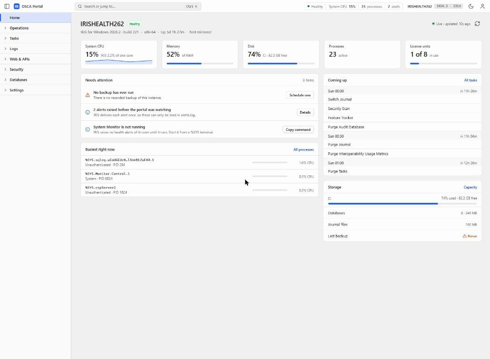
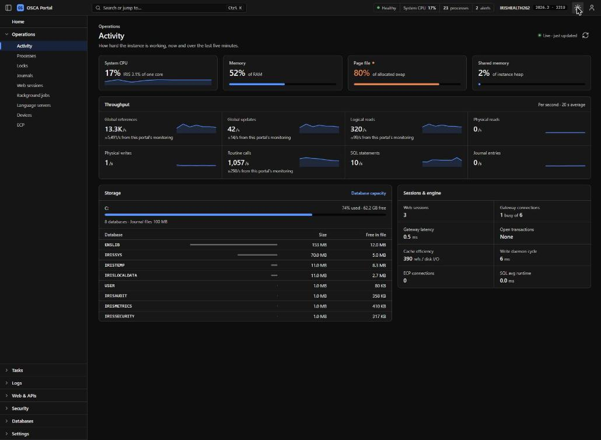
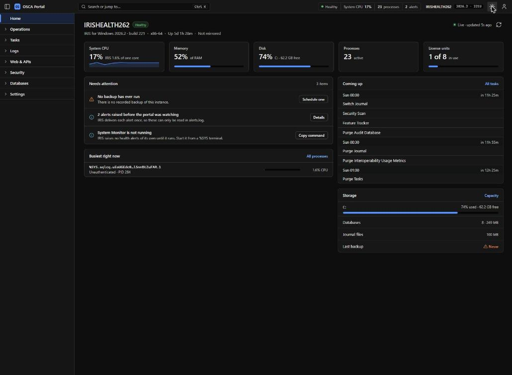
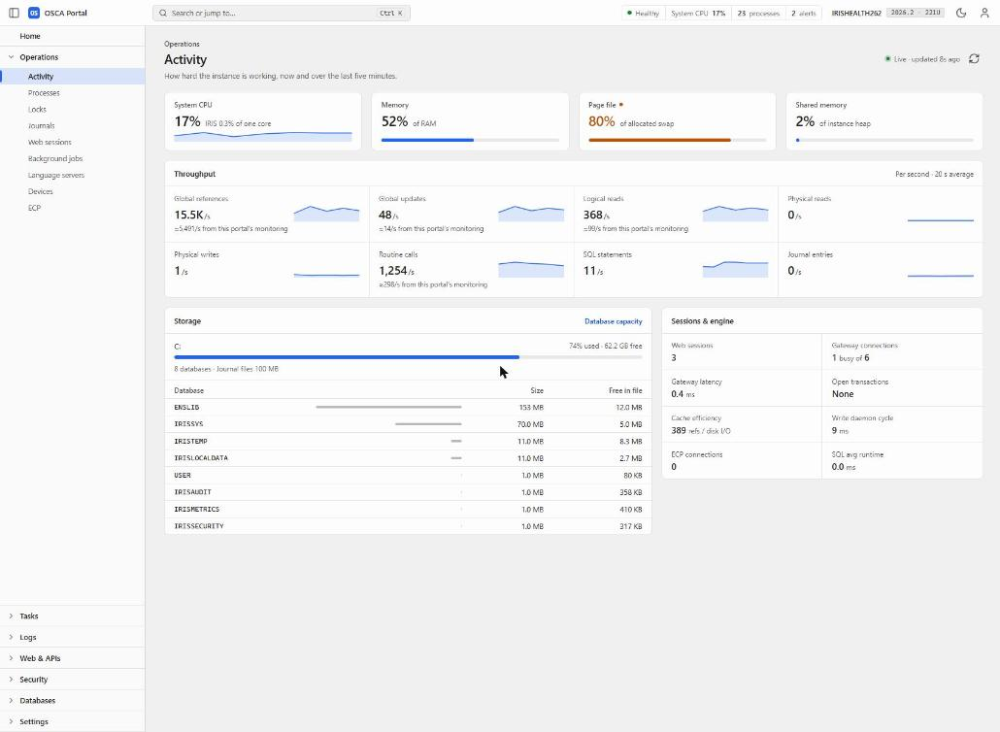
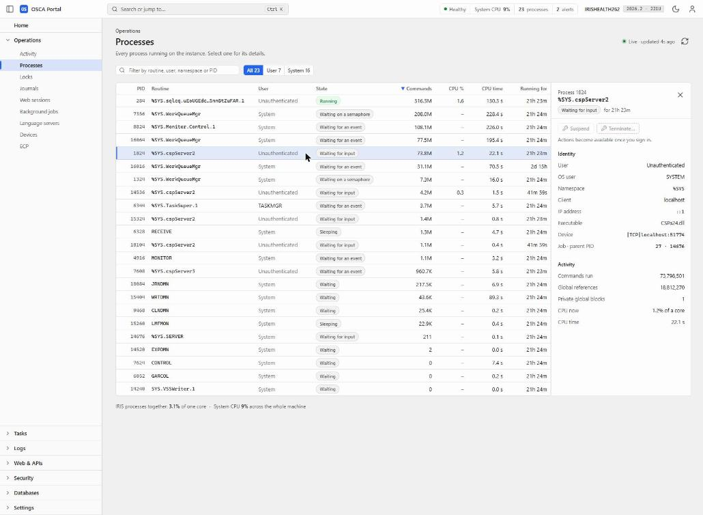
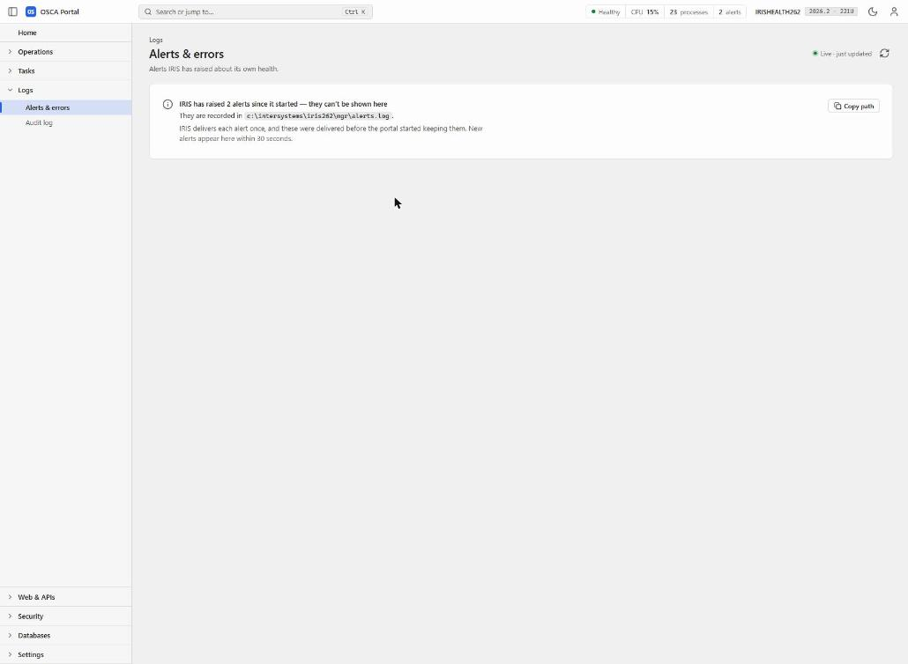

# OSCA Portal

A desktop-grade management portal for InterSystems IRIS 2026.2, built on the new SysAdmin REST API (`%Api.Admin`, `/api/admin`) and the monitoring API (`%Api.Monitor`, `/api/monitor`).

OSCA Portal is a sibling of the [OSCA](https://github.com/seanconnelly) web IDE and uses the same component library, Evolution UI. It is an entry in the InterSystems Programming Contest: Build Your Own Management Portal.



## Status

This is a working application on live data, being built in public during the contest.

| Area | Status |
|---|---|
| Home, Operations › Activity, Operations › Processes, Logs › Alerts & errors | Complete |
| Sign-in with the Admin API's JWT login (access-token refresh, sign-out, optional escalation role) | Done |
| Security, Web & APIs, Tasks, Databases, Settings | In the menu, being built during the voting period |

Screens that are not built yet say so and name the endpoint they will use. Nothing in the portal pretends to work when it does not.

## What it covers

The contest asks for web app and REST API management, permissions, security and secrets, tasks, operating system resources, and logs. Here is where each lives:

| Contest area | Where in the portal | Status |
|---|---|---|
| OS management: processes, CPU, memory, disks | Home; Operations › Activity; Operations › Processes; Databases › Capacity | Home, Activity, Processes complete |
| Log reporting | Logs › Alerts & errors; Logs › Audit log | Alerts complete |
| Web apps and REST APIs | Web & APIs › Web applications, API explorer | In progress |
| Permissions | Security › Users, Roles, Resources, SQL privileges | In progress |
| Security and secrets | Security › Secrets wallet, Certificates & TLS, OAuth 2.0 | In progress |
| Tasks | Tasks › Upcoming, History, Schedule | In progress |

## How it works

**One menu, ordered by use.** The left menu is an accordion that fills the panel. The group you are in is always open, and groups below it stay pinned to the bottom, so the menu never changes shape. Groups run from most to least used: Operations, Tasks, Logs, Web & APIs, Security, Databases, Settings.

**Health without navigating.** The toolbar shows instance state, System CPU, process count and alerts on every page. Each part links to the screen behind it.

**Ctrl K.** A command palette jumps to any screen by name.

**Live, and honest about it.** Each screen shows when it last refreshed and refreshes on its own.

**Review before change.** Screens that change the instance will end on a single review-and-confirm step before anything is written. Actions that need a signed-in user are shown but locked until sign-in.



## What we learned about the new APIs

Building on live data turned up several behaviours worth knowing if you build on these APIs too.

- **The alerts feed is read-once.** `/api/monitor/alerts` hands each alert to one reader only (the `iris_system_alerts_new` metric documents this). The portal keeps every alert it receives. When alerts were delivered before the portal was watching, the Alerts screen says so, shows IRIS's own total, and gives the path to `alerts.log`.
- **Per-second sensors break with more than one reader.** The Prometheus `*_per_sec` metrics are computed between consecutive scrapes, so a second tab or a Prometheus server corrupts them. The portal computes throughput itself from the cumulative counters in `/api/admin/v2/monitor/system-usage`, averaged over 20 seconds.
- **Monitoring has a cost.** One `/api/monitor/metrics` scrape costs IRIS about 55,000 global references. On an idle instance that is most of the reported load. The Activity page measures the portal's own share live and shows it under each figure it affects.
- **System CPU and IRIS CPU are different numbers.** `iris_cpu_usage` covers the whole machine. The portal adds up CPU used by IRIS processes between polls and states it as "% of one core", because the API does not expose a core count to convert it honestly.
- **A process's routine is its current routine.** CSP server processes change routine between requests, so the Processes screen labels the column "Current routine".

## Screens

| | |
|---|---|
|  |  |
|  |  |

## Requirements

- InterSystems IRIS or IRIS for Health **2026.2 or later**. The SysAdmin API does not exist in 2026.1.
- For Docker: Docker with Compose.
- For building from source: Node.js 20+ and npm.

## Install

The repository includes the built app in `dist-web/`, so installing needs no Node.js and no build step.

### Docker

```
git clone <this repository> osca-portal
cd osca-portal
docker compose up -d --build
```

Open http://localhost:52773/portal/index.html and sign in as `_SYSTEM` / `SYS`. (IRIS does not serve `index.html` for a bare folder URL, so include it.)

The image is `intersystemsdc/irishealth-community:2026.2-zpm`. Do not switch it to `latest`: at the time of writing `latest` is 2026.1, which does not have the Admin API.

### IPM (ZPM)

From a local clone, in an IRIS terminal:

```
zpm "load /path/to/osca-portal"
```

Once the package is published:

```
zpm "install osca-portal"
```

Then open `http://<host>:<web port>/portal/`.

## Development

The portal depends on Evolution UI (`@evolution-ui/core`) as a sibling checkout, not from npm. Clone both side by side:

```
<parent>/
  evolution-ui-2/   the Evolution UI library
  osca-portal/      this repository
```

`package.json` references it as `file:../evolution-ui-2`, and `vite.config.ts` resolves `@evolution-ui/core` to `../evolution-ui-2/src`, so library changes show up without a separate library build.

```
npm install
cp .env.example .env    # set IRIS_HOST, IRIS_PORT, and optionally IRIS_USERNAME / IRIS_PASSWORD
npm run dev             # http://localhost:5274
```

The Vite dev server proxies `/api` to IRIS. If `.env` sets a username and password, the proxy adds Basic authentication on the server side, so credentials never reach the browser.

Other scripts:

```
npm run typecheck
npm ci && npm run build # production build to dist-web, served by IRIS at /portal/
```

## Architecture

- TypeScript and Vite, no framework. The screens are plain modules that render into an Evolution UI shell.
- Evolution UI components throughout: `ev-shell`, a fill-mode `ev-accordion` for the menu, `ev-data-grid`, `ev-sparkline`, `ev-command-palette` and more.
- `src/screens/` holds one module per screen. `src/metrics.ts` (Prometheus feed), `src/usage.ts` (throughput from counters), `src/iris-cpu.ts` (IRIS CPU per process) and `src/alerts.ts` (read-once alert store) are shared data sources, so every screen states the same figure the same way.
- The built app is served by IRIS itself as a web application, so the browser talks to the APIs same-origin.

## Licence

GNU Affero General Public License v3.0. See [LICENSE](LICENSE).

## Author

Sean Connelly. Developer Community profile: _link to be added_.
