# OSCA Admin

*A modern administration portal for InterSystems IRIS, built on the new IRIS 2026.2 management REST APIs.*

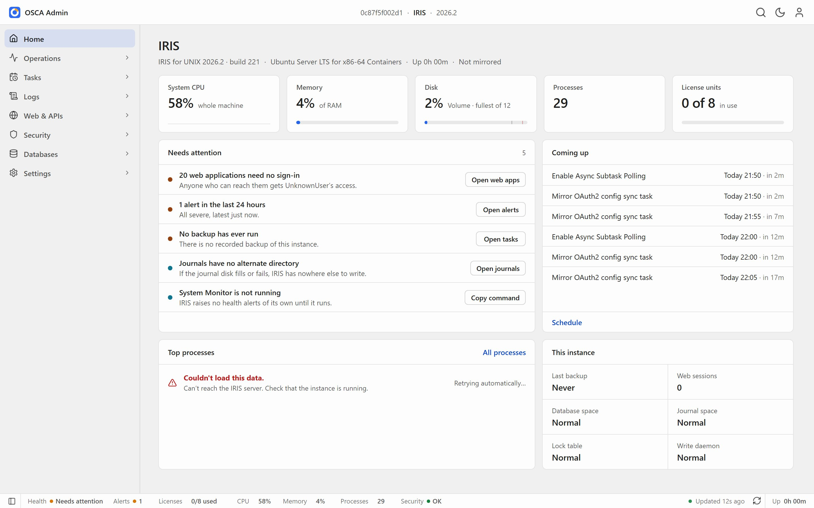

## Demo video

[](https://www.youtube.com/watch?v=oaxHAelGpFo)

[Watch the demo on YouTube](https://www.youtube.com/watch?v=oaxHAelGpFo)

## About this project

OSCA Admin is a **demo application** built for the InterSystems Developer Community contest **[Build Your Own Management Portal](https://community.intersystems.com/post/intersystems-programming-contest-build-your-own-management-portal)** (14 September to 4 October 2026).

IRIS 2026.2 introduced REST APIs for managing an instance: the **SysAdmin API** (`/api/admin`) for configuration and security, and the **Monitor API** (`/api/monitor`) for metrics and alerts. The contest asks developers to build their own graphical management portal on top of these APIs, covering web applications and REST APIs, permissions, security and secrets, task scheduling, operating-system monitoring, and logging.

This is our entry. It is a working portal, not a mock-up: every figure is live and every form really creates, changes or deletes objects on the instance.

## What it is

OSCA Admin opens on one question: *is this instance OK, and does anything need me?* It answers with a triage list where every item has one action. Behind that are around 40 screens:

- **Operations:** live activity, processes, locks, journals, web sessions and background jobs.
- **Tasks:** a 7-day schedule, run history, and a wizard for new tasks.
- **Logs:** alerts, the audit log and the console log (messages.log).
- **Web and APIs:** web applications, and an explorer for every REST API on the instance.
- **Security:** users, roles, resources, SQL privileges, services, certificates, OAuth 2.0, encryption and the secrets wallet.
- **Databases:** namespaces, databases and capacity.

Every change shows what it will do before it is saved. A change that could lock someone out, or let anyone in, explains the risk and asks you to confirm.

## Quick start

You need Docker with Compose.

```
git clone https://github.com/SeanConnelly/osca-admin.git
cd osca-admin
docker compose up -d --build
```

After about two minutes, open **http://localhost:52780/portal/index.html** and sign in as `_SYSTEM` / `SYS`.

The container uses ports 52780 (web) and 51780 (superserver), so it won't clash with an IRIS instance you already run.

**Install with IPM instead.** On IRIS or IRIS for Health **2026.2 or later**, clone the repository as above, then in an IRIS terminal in the namespace to install into (for example `USER`): `zpm "load /path/to/osca-admin"`, where the path is the folder you cloned. Then open `http://<host>:<port>/portal/index.html`. The app is prebuilt, so no Node or build step is needed.

## How it works

```
 Browser                              InterSystems IRIS 2026.2
 ┌─────────────────────────┐          ┌──────────────────────────────────────────┐
 │ OSCA Admin              │  static  │ /portal       the built app (HTML, JS)   │
 │ single-page app         │◄─────────┤                                          │
 │                         │          │ /api/admin    SysAdmin API: config,      │
 │ TypeScript screens      │  REST +  │               security, tasks, databases │
 │ in-house widget library │  JWT     │ /api/monitor  metrics and alerts         │
 │ (custom elements)       ├─────────►│ /api/mgmnt    list of REST applications  │
 │                         │          │ /api/osca     small read-only extension  │
 └─────────────────────────┘          └──────────────────────────────────────────┘
```

- **A single-page app served by IRIS itself.** The front end is TypeScript, built with Vite into static files that IRIS serves at `/portal`. There is no separate web server and no framework. The screens use our in-house widget library, built on standard custom elements (Web Components): the shell, data grids, forms, dialogs and charts.
- **Only the management APIs.** Every screen reads and writes through the SysAdmin and Monitor APIs. You sign in with the API's own JWT login, and every request runs with your IRIS privileges, so the portal can never do more than you can.
- **One source for each figure.** Shared data sources for metrics, CPU, usage and alerts mean every screen shows the same number the same way. Live screens poll gently, and the Activity page even shows what its own monitoring costs.
- **A small extension where the APIs stop.** Where the new APIs couldn't do something a portal needs, we added a small read-only API, `/api/osca` (ObjectScript, one class). It covers server file pickers, the server's name, login history, the task catalogue and the console log. It always checks the caller's own privileges. We documented these and the other gaps for InterSystems in [docs/api-gaps.md](docs/api-gaps.md).

## A tour

### Monitoring the instance

**Home** triages the instance: five headline figures, *Needs attention* with one action per item, and the tasks coming up next (top of this page).

**Activity** shows CPU, memory and throughput live, with 15-minute trends, in light or dark theme.

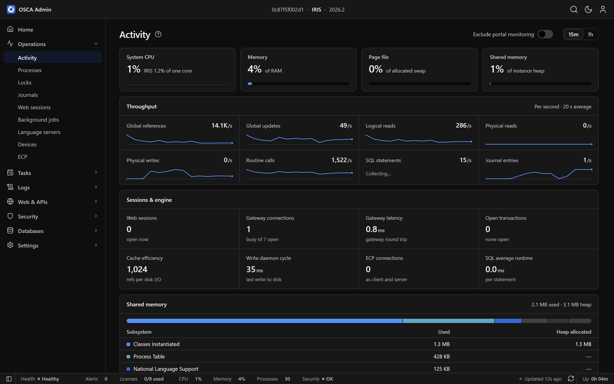

**Processes** lists every process. Click one to see what it is running, who it runs as and what it holds, without leaving the list.

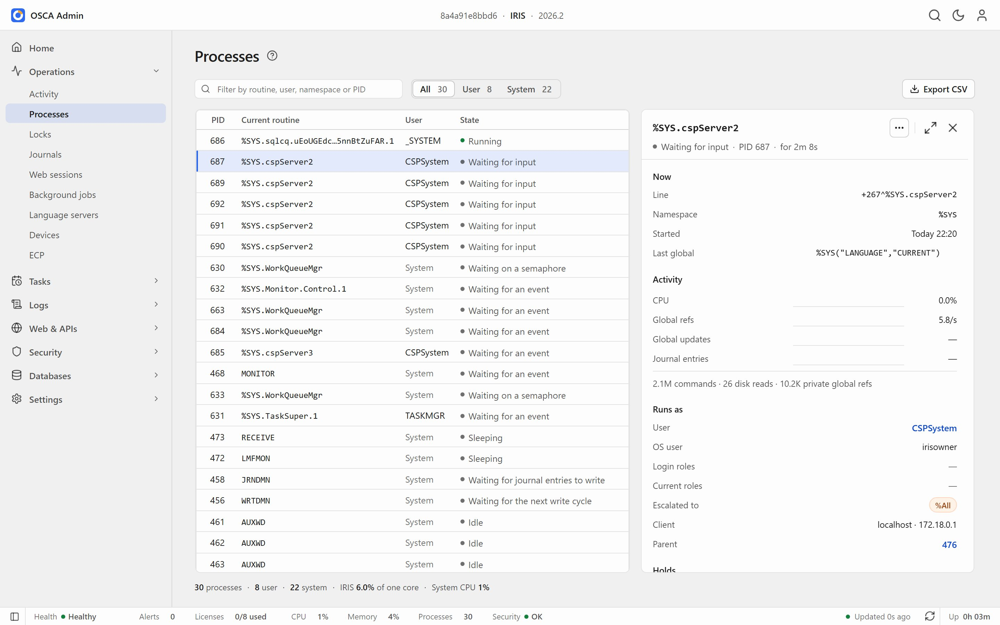

### Scheduling tasks

**Schedule** lays out the next seven days of the Task Manager on one grid, including suspended tasks and tasks that run after another task.

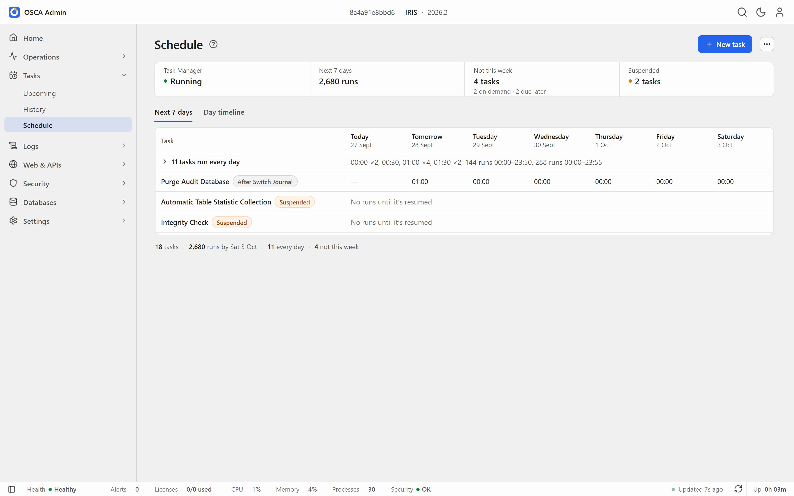

**New task** is a four-step wizard (what, when, options, review) listing every task type IRIS offers.

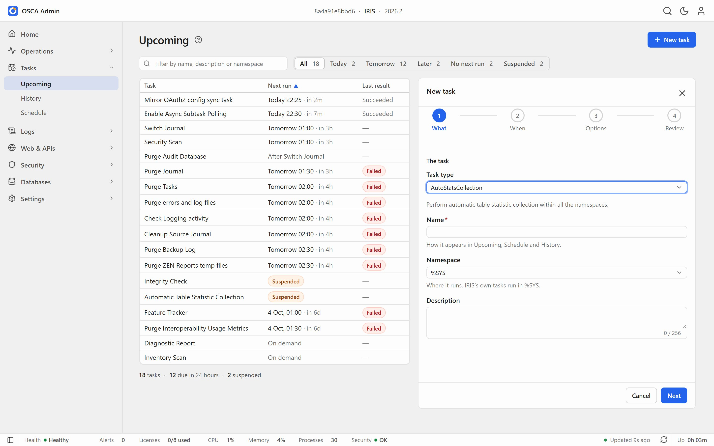

### Managing users: create, read, update, delete

The **Users** list shows state and access at a glance. Selecting a user opens a summary alongside the list.

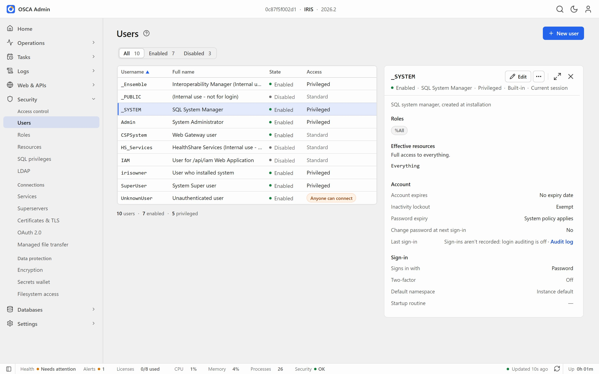

**Create.** The New user form explains each setting in plain words, and shows what the new user will be able to do before you save.

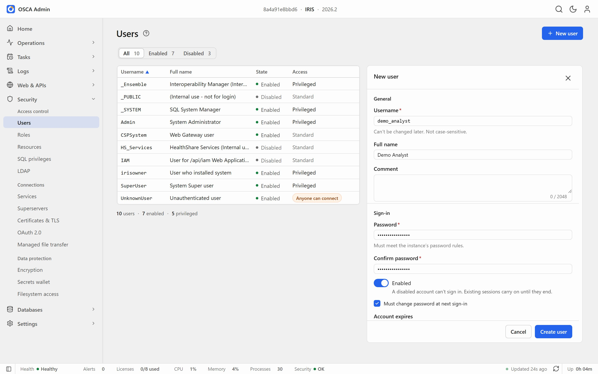

Risky changes are reviewed first. Giving the new user `%Developer` asks for confirmation and says exactly what it grants.

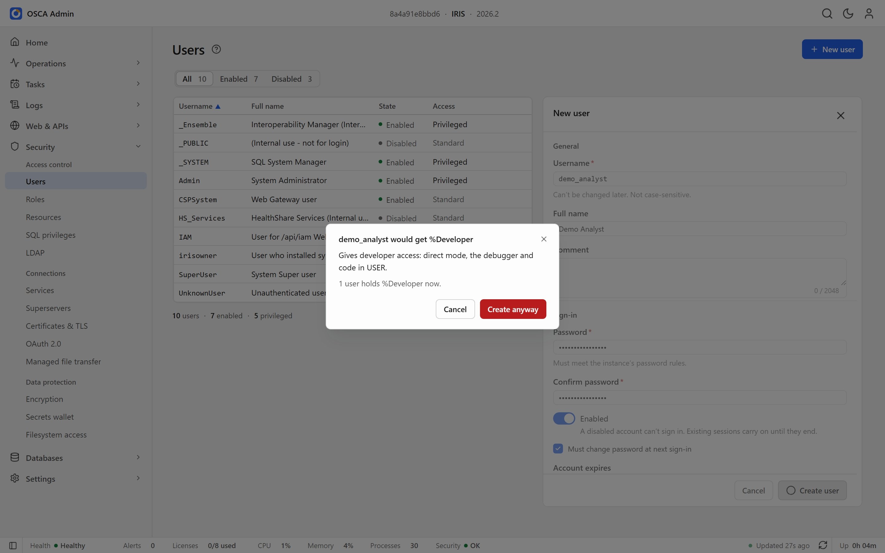

**Update.** Any object opens full-page, and you edit it in place. The ‹ › pager steps through the list, and unsaved changes are always caught.

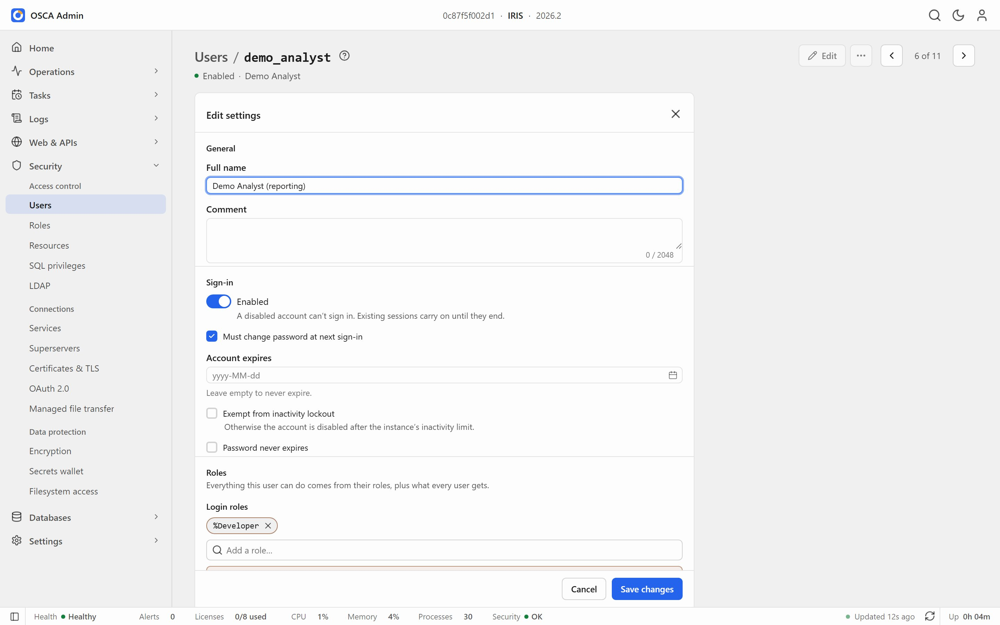

**Read.** After saving, the full view shows everything about the user: effective resources and where each comes from, account and sign-in settings, and the web applications they can open.

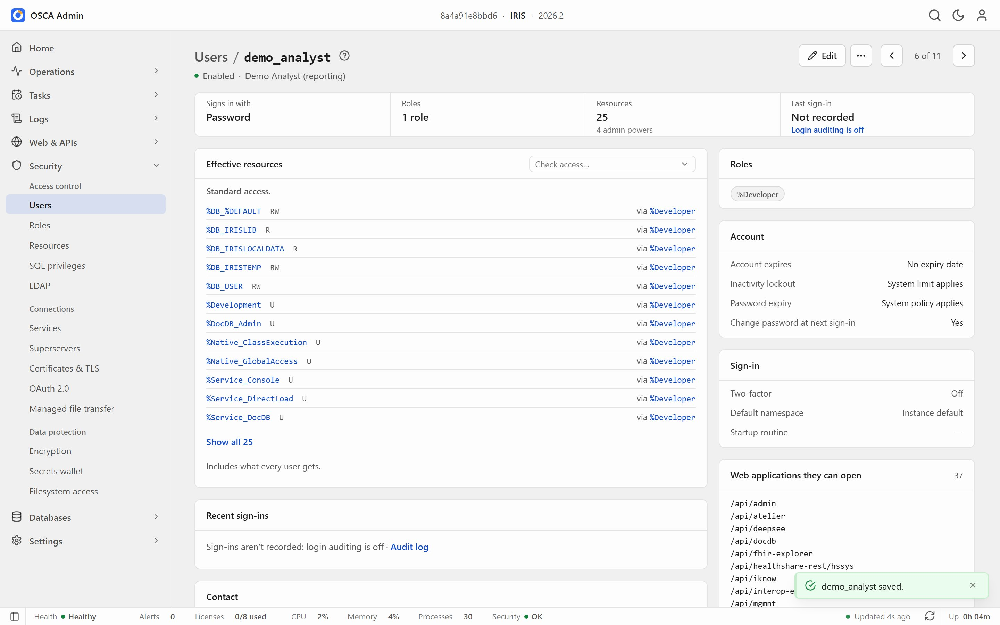

**Delete.** Deleting asks you to type the name, and offers the safer choice of disabling the account instead.

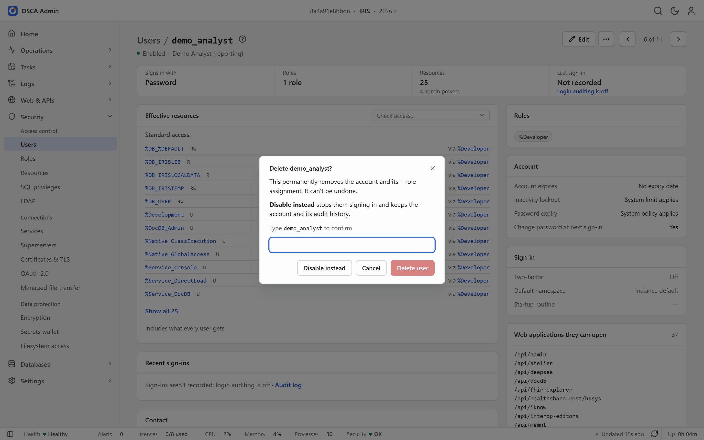

### Web applications, databases and logs

**Web applications** explains each application in plain language, and warns when anyone can connect without signing in.

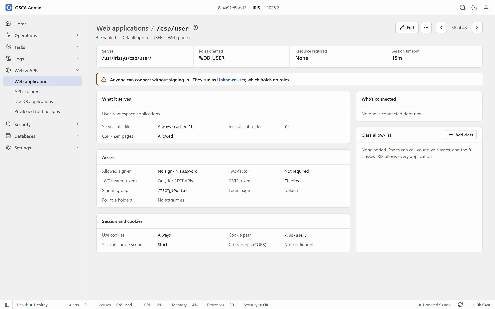

**Databases** includes a desktop-style picker for choosing folders on the server when creating a database.

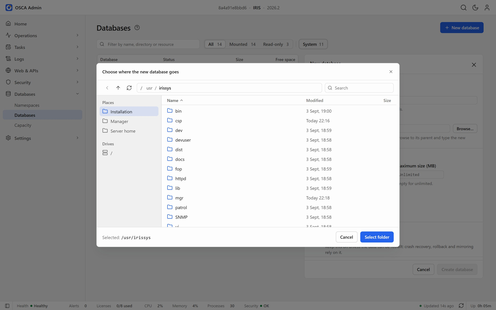

**Messages log** reads the instance's console log, with search, level filters and full details for each line.

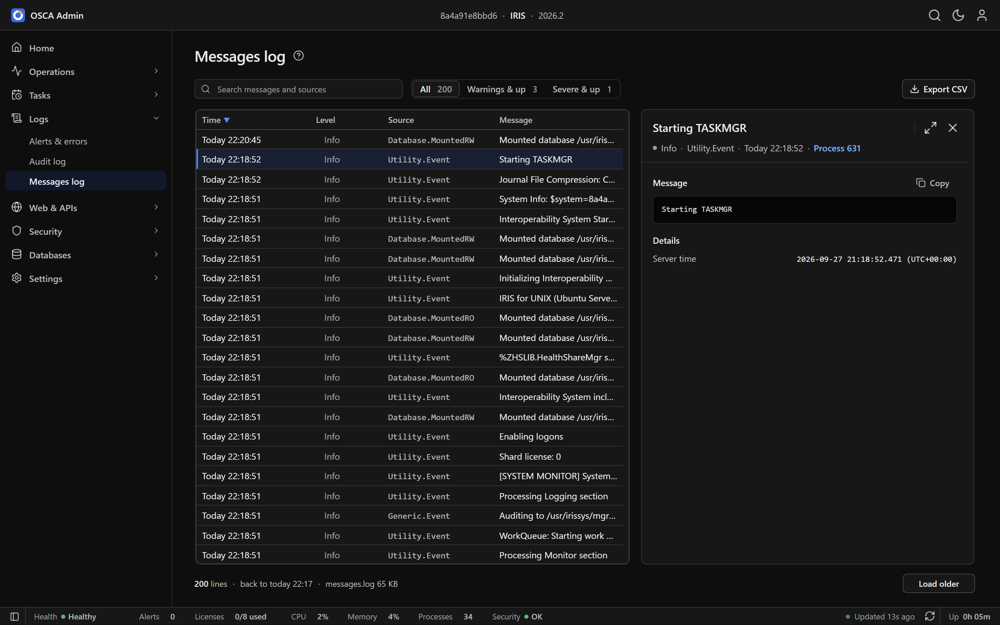

## Contest areas

| Contest area | Where in OSCA Admin |
|---|---|
| Web apps and REST APIs | Web & APIs › Web applications, API explorer |
| Permissions | Security › Users, Roles, Resources, SQL privileges |
| Security and secrets | Security › Services, Certificates & TLS, OAuth 2.0, Encryption, Secrets wallet |
| Task scheduling | Tasks › Upcoming, Schedule, History, New task |
| OS resource monitoring | Home; Operations › Activity, Processes; Databases › Capacity |
| Logging and reporting | Logs › Alerts & errors, Audit log, Messages log |

## What installing changes

The installer (used by both Docker and IPM) makes three changes, and only ever *adds* authentication methods:

1. It turns on JWT and password sign-in for `/api/admin`, `/api/monitor` and `/api/mgmnt`, printing the before and after values.
2. It creates `/api/osca`, the read-only extension API, with an application role (`OscaAdminAPI`) that grants read access to its own namespace only.
3. It creates `/portal`, which serves the app's static files.

`zpm "uninstall osca-portal"` removes the extension and its role. With Docker, `docker compose down` removes everything.

## Licence

**AGPL-3.0**: the GNU Affero General Public License, version 3 or later. You can use, change and share OSCA Admin freely; if you run a modified version as a service for others, you must share your changes under the same licence. See [LICENSE](LICENSE).

## Author

Sean Connelly. [Demo video on YouTube](https://www.youtube.com/watch?v=oaxHAelGpFo).

---

OSCA Admin is an independent open-source project. It is not affiliated with or endorsed by InterSystems. InterSystems and IRIS are trademarks of InterSystems Corporation.
